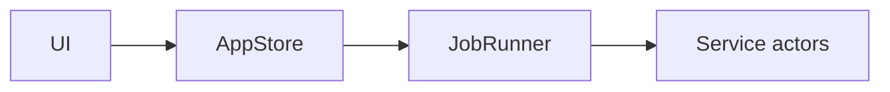

# Doc style guide

Voice, terminology, formatting conventions for Sojourn docs.
[DOCS_POLICY.md](DOCS_POLICY.md) covers structure; this file covers prose.

## Voice

- Address the reader as "you", not "the user", except in reference pages
  describing internal types where "the user" is the system actor.
- Active voice. "Sojourn writes the snapshot" beats "the snapshot is written
  by Sojourn".
- Imperative for how-to steps: "Open Settings → Sync. Click Push."
- Past tense only for ADR Context sections.

## Terminology

Use consistently:

| Use | Don't use |
|---|---|
| Sojourn (capital S, no italics) | sojourn, **Sojourn**, *Sojourn* |
| dotfile | "dot file", "dotfile" without article in lists |
| package manager | "package-manager" (one word, no hyphen) |
| writer lock | "active writer lock" (redundant), "the lock" alone |
| pre-flight | not "preflight" or "pre flight" |
| push / pull | not "sync up" / "sync down" |
| Mac | macOS device. "machine" is fine when ambiguous. |
| age | lowercase even at sentence start (this is the upstream convention) |
| chezmoi | lowercase (upstream convention) |
| mpm | lowercase (upstream convention) |

## Formatting

- Code spans for command names, file paths, identifiers, and CLI flags.
- Triple-backtick fenced blocks with a language tag. Never bare ```.
- Tables for ≥3 rows of structured data. Bullet lists for unordered items.
- Numbered lists only when sequence matters.
- Bold for terms on first introduction in a page; italic for subtle emphasis.
- Em-dash (`—`) for parenthetical asides; hyphen for compound words; en-dash
  (`–`) for ranges.

## Links

- Inline `[text](path)` for short links.
- Reference-style for repeated links:

```markdown
See the [architecture overview][arch] and [module map][modules].

[arch]: ../reference/architecture.md
[modules]: ../reference/modules.md
```

## Diagrams

Mermaid first. PNG only when mermaid cannot represent (e.g., screenshots, UI
mockups, hand-drawn flow charts). PNGs go in `docs/assets/diagrams/` and are
referenced from at most one page.



## Length

| Page type | Target | Hard cap |
|---|---|---|
| Tutorial step | 200–400 lines | 600 |
| How-to | 50–150 lines | 300 |
| Reference page | 100–300 lines | 800 |
| Explanation | 100–300 lines | 600 |
| ADR | 30–80 lines | 150 |

If you exceed the hard cap, split.
