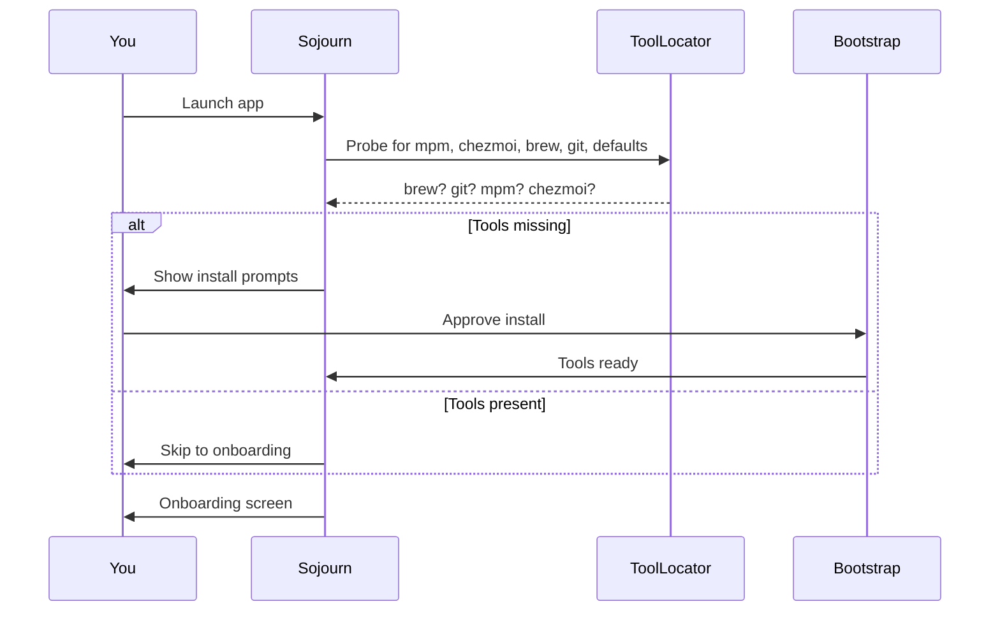

# 01 — Install Sojourn on a single Mac

## What you'll do

Install Sojourn on one Mac for the first time. By the end you'll have
Sojourn running, Homebrew installed, `mpm` and `chezmoi` detected, and
the app sitting at the *Onboarding* screen ready for tutorial 02 or
03.

## Prerequisites

- macOS 14 (Sonoma) or newer.
- Admin access on this Mac (you'll type your password once for
  Homebrew install).
- ~10 minutes of attention.

## Steps

### 1. Download Sojourn

Grab the latest signed `.dmg` from the [releases page](https://github.com/Bizarre-Industries/Sojourn/releases).

Drag *Sojourn.app* to */Applications*.

### 2. First launch

Open Sojourn from *Applications*. macOS shows a Gatekeeper prompt
("Sojourn was downloaded from the internet"). Click *Open*. You only
see this once.

Sojourn opens to the *Welcome* screen and immediately starts the
bootstrap state machine:



### 3. Install Homebrew if needed

If you don't already have Homebrew, Sojourn shows an *Install
Homebrew* button. Sojourn uses the **signed `.pkg` installer**
(decision in [decisions/0008-no-curl-bash-for-brew.md](../decisions/0008-no-curl-bash-for-brew.md))
rather than `curl | bash`.

Click *Install Homebrew*. macOS prompts for your password (the `.pkg`
needs admin to write `/opt/homebrew/`). Type it. Wait for the
progress bar to finish.

### 4. Sojourn installs `mpm` and `chezmoi`

Sojourn installs both via Homebrew automatically (no further user
input):

```sh
brew install meta-package-manager
brew install chezmoi
```

You'll see a streaming log in Sojourn while this runs.

### 5. Pre-flight check for Full Disk Access

Sojourn shows the FDA opt-in screen. **You can skip this for now**
unless you want to sync sandboxed Mac App Store apps' preferences.

If you skip: Sojourn syncs unsandboxed apps only. You can opt in
later via *Settings → Preferences*.

If you grant: macOS opens *Privacy & Security → Full Disk Access*.
Toggle Sojourn on. Restart Sojourn (it has to relaunch to pick up
FDA).

### 6. Land at the onboarding screen

Sojourn shows two paths:

- **Set up new repository** — for tutorial 02.
- **Onboard from existing repository** — for tutorial 03.

Don't pick either yet — this tutorial is just about getting Sojourn
installed and verified.

## Verification

- *Settings → Tools* shows `mpm`, `chezmoi`, `brew`, `git`,
  `defaults`, `gitleaks`, `age` all green.
- *Settings → About* shows the Sojourn version you downloaded.
- The History pane is empty (no jobs yet).

## Troubleshooting

- **Gatekeeper refuses to open Sojourn** — *System Settings →
  Privacy & Security → Open Anyway*. Once is enough.
- **Homebrew install fails with "no admin"** — you need a user
  account that can run `sudo`. Sojourn cannot install Homebrew
  for a non-admin user.
- **`mpm` install hangs** — `brew install` can be slow on first
  run (refreshing taps). Wait. If still hung after 5 minutes,
  check History → kill the job, then retry.

## Next

- Tutorial [02 — First push](02-first-push.md) creates a brand-new
  data repo from scratch.
- Tutorial [03 — Second machine](03-second-machine.md) onboards
  this Mac into an existing data repo.

## See also

- [explain/bootstrap-state-machine.md](../explain/bootstrap-state-machine.md)
  — the state machine you just walked through.
- [decisions/0008-no-curl-bash-for-brew.md](../decisions/0008-no-curl-bash-for-brew.md).
- [how-to/diagnostics/reset-tool-detection.md](../how-to/diagnostics/reset-tool-detection.md)
  — if a tool stays grey.
