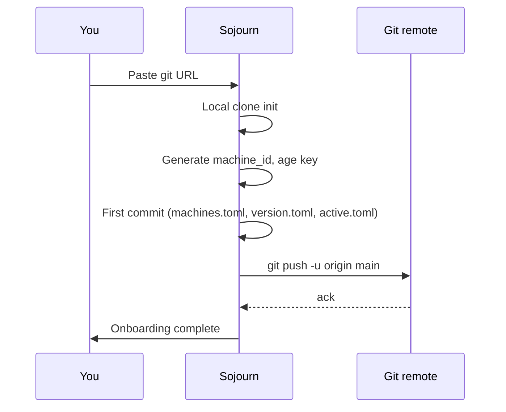

# 02 — Set up a new data repository

## What you'll do

Create a fresh git repository to hold your Sojourn-managed setup,
back up your current packages and dotfiles into it, and push the
first commit.

## Prerequisites

- Tutorial [01 — Install](01-install.md) complete.
- A GitHub (or GitLab / Bitbucket / self-hosted git) account.
- ~15 minutes.

## Steps

### 1. Create an empty git repo

On GitHub: *New repository* → name it (e.g. `sojourn-setup`) →
**Private** → *Create*. Don't initialise with a README — Sojourn
seeds the repo.

Copy the SSH URL: `git@github.com:<you>/sojourn-setup.git`.

### 2. Tell Sojourn where to push

In Sojourn → onboarding screen → **Set up new repository**.

Paste the git URL. Click *Continue*.

### 3. Authorise GitHub (optional)

Sojourn offers two paths for git auth:

- **BYO** — your existing `git-credential-osxkeychain` already has
  GitHub credentials. Sojourn uses them. Skip Device Flow.
- **Device Flow** — sign in via the GitHub Device Flow. Sojourn
  shows a one-time code; you paste it into github.com/login/device.
  Token lives in macOS Keychain under `app.bizarre.sojourn`.

Pick whichever you prefer. Tutorial 03 needs git auth working too.

### 4. Initial backup

Sojourn now scans:

- All package managers it can detect via `mpm managers`.
- Common dotfile owners (`~/.zshrc`, `~/.gitconfig`, `~/.ssh/config`,
  …) per [reference/cleanup.md](../reference/cleanup.md).
- Tracked unsandboxed app preferences if you opted in.

You see a summary screen:

| Backend | Items |
|---|---|
| brew | 47 formulae, 12 casks |
| npm | 8 globals |
| pip | 3 globals |
| chezmoi (dotfiles) | 12 files |
| Preferences | 0 (you'll add later) |

Click *Back up and push*.

### 5. The first push happens

Sojourn:

1. Runs `mpm backup ~/.local/share/chezmoi/packages.toml`.
2. Runs `chezmoi add` for each detected dotfile.
3. Runs `gitleaks dir --staged` against the staged tree. **Stop and
   read** any findings — see
   [how-to/secrets/handle-finding.md](../how-to/secrets/handle-finding.md).
4. If no findings: commits with message `Initial backup from
   <hostname>` and pushes.

Push takes 5–30 seconds depending on dotfile count.

## Verification

- `git log` in `~/.local/share/chezmoi/` shows your initial commit
  pushed.
- The remote (e.g. github.com/<you>/sojourn-setup) has files:
  - `packages.toml`
  - `dot_zshrc`, `dot_gitconfig`, etc.
  - `.sojourn/active.toml` (with this Mac as active writer)
  - `.sojourn/machines/MAC-XXXX.toml`
- Sojourn's footer chip shows *Active writer · this-Mac*.

## Troubleshooting

- **gitleaks finds a secret in your dotfiles** — common for
  `.aws/credentials` or `.npmrc` with auth tokens. Either redact and
  use a secret broker
  ([how-to/secrets/set-up-1password.md](../how-to/secrets/set-up-1password.md))
  or add an allowlist
  ([how-to/secrets/customize-gitleaks-rules.md](../how-to/secrets/customize-gitleaks-rules.md)).
  Don't push until findings are zero.
- **Push fails with "permission denied"** — git auth isn't working.
  Test `git push` from Terminal manually; fix credentials there;
  retry from Sojourn.
- **"Manager errored: pip"** — pip's mpm wrapper doesn't implement
  `search`; this fires harmlessly during backup. Ignore unless your
  Mac actually has no pip and you want it tracked.

## Next

- Tutorial [03 — Second machine](03-second-machine.md) onboards
  another Mac into the same repo.
- [how-to/dotfiles/add-template.md](../how-to/dotfiles/add-template.md)
  — make a dotfile template per-Mac variable.
- [how-to/secrets/set-up-1password.md](../how-to/secrets/set-up-1password.md)
  — replace plaintext secrets with op:// references.

## See also

- [reference/sync-model.md](../reference/sync-model.md).
- [explain/bootstrap-state-machine.md](../explain/bootstrap-state-machine.md).
- [decisions/0006-gitleaks-bundled.md](../decisions/0006-gitleaks-bundled.md).
