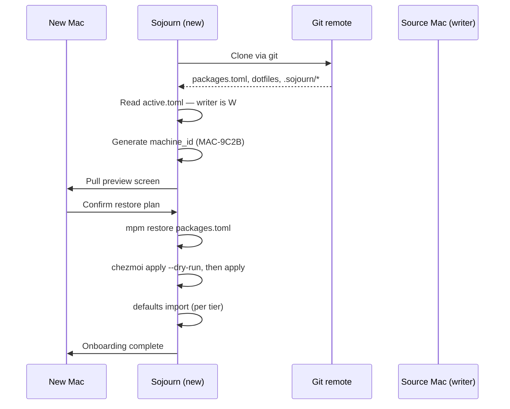

# 03 — Onboard a second Mac

## What you'll do

Bring a Mac into an existing Sojourn-managed setup created via
tutorial 02. The new Mac gets the packages, dotfiles, and (optionally)
preferences from the data repo.

## Prerequisites

- Tutorial [01 — Install](01-install.md) complete on the new Mac.
- Tutorial [02 — First push](02-first-push.md) complete on the
  source Mac, with at least one push to the remote.
- The git URL of the data repo.
- Same GitHub auth as the source Mac (so the new Mac can pull).
- ~15 minutes.

## Steps

### 1. Onboard from existing repository

In Sojourn → onboarding screen → **Onboard from existing
repository**.

Paste the git URL. Click *Continue*.

### 2. Pull preview

Sojourn shows everything it's about to do:

- **Packages**: 47 brew formulae, 12 casks, 8 npm globals (etc.) to
  install.
- **Dotfiles**: 12 files to write under `~`.
- **Preferences**: 0 (or whatever was tracked on the source Mac).

For each section you can:

- **Apply all** — let Sojourn proceed.
- **Review** — see the actual diff for each file.
- **Skip** — leave the section unprocessed.

### 3. Take or share the writer lock

The data repo's `.sojourn/active.toml` records the source Mac as the
writer. Sojourn shows you this:

> Active writer: source-Mac (acquired 2 hours ago)
>
> This Mac is currently a **reader**. To push from here, take the
> writer lock from *Settings → Sync → Take writer lock*.

You can leave it — most fleet setups have one Mac that pushes and
others that only pull. See
[how-to/sync/transfer-writer-lock.md](../how-to/sync/transfer-writer-lock.md)
when you want to switch.

### 4. age key handoff (if encrypted dotfiles exist)

If the source Mac uses age-encrypted dotfiles, the new Mac doesn't
have the private key yet. Two options:

- **Add the new Mac as an age recipient** — on the source Mac, copy
  the new Mac's public key from *Settings → Secrets → age* into the
  recipients list, then push. New Mac re-pulls and decrypts.
- **Use 1Password / Bitwarden instead** — if the source uses
  password-manager templates rather than age, the new Mac just needs
  the same broker installed and signed in.

See [how-to/sync/rotate-age-keys.md](../how-to/sync/rotate-age-keys.md)
for the recipient-add flow.

### 5. Apply the restore plan

Click *Restore everything*. Sojourn:

1. Runs `mpm restore` for each manager (parallel by manager).
2. Runs `chezmoi apply --dry-run` then real apply.
3. For tracked preferences: runs `defaults import` per app, quitting
   the app first if running.

Streaming log in Sojourn shows progress. Restore takes 2–10 minutes
depending on package count.

### 6. Verify

After the restore completes, Sojourn shows the *Up to date* state.
The History pane logs the onboarding restore.

## Verification

- `which mpm chezmoi` shows the same versions as the source Mac.
- `~/.zshrc` (or whatever your shell is) is the synced version.
- A test command from your shell (e.g. an alias defined in
  `~/.zshrc`) works.
- *Settings → Sync* shows *Up to date*.

## Troubleshooting

- **"Pull failed: authentication required"** — git credentials
  aren't set up on the new Mac. Either run `git push` once from
  Terminal to populate `git-credential-osxkeychain`, or use
  Sojourn's Device Flow opt-in.
- **"`chezmoi apply` failed on `.aws/credentials`"** — the file
  uses `op://` references but 1Password isn't installed on the new
  Mac. Install 1Password, sign in, retry.
- **"Restore stuck on cask install"** — some casks require
  password (admin) on first install. macOS may have prompted in the
  background. Check the running tasks.

## Next

- Tutorial [04 — Recover from loss](04-recover-from-loss.md) for
  the wiped-Mac case.
- Make per-Mac differences explicit:
  [how-to/packages/exclude-per-machine.md](../how-to/packages/exclude-per-machine.md).
- Templated dotfiles for per-Mac differences:
  [how-to/dotfiles/add-template.md](../how-to/dotfiles/add-template.md).

## See also

- [reference/sync-model.md](../reference/sync-model.md).
- [explain/carry-vs-sync.md](../explain/carry-vs-sync.md) — why
  this is a "carry" operation.
- [explain/cooperative-locking.md](../explain/cooperative-locking.md).
