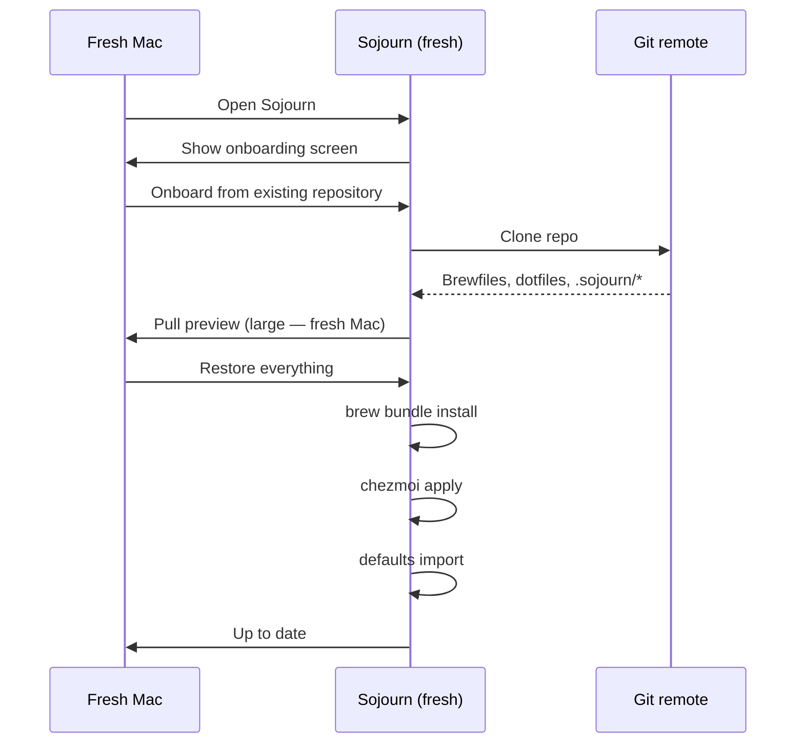

# 04 — Recover on a fresh Mac

## What you'll do

Restore your full Sojourn-managed setup on a Mac that has lost or
never had Sojourn (post-erase, replacement hardware, fresh install).
End state matches the previous Mac's state at last push.

## Prerequisites

- The git URL of your data repo.
- Access to the git remote (GitHub credentials still work).
- A backup of your age private key (if you use encrypted dotfiles)
  **or** a secondary Mac that can re-add this fresh Mac to the age
  recipients.
- ~30 minutes.

## Steps

### 1. Install Homebrew (or let Sojourn do it)

If you've just done a fresh macOS install, Homebrew probably isn't
present. Two paths:

- **Install Sojourn first** (via DMG). Sojourn's bootstrap installs
  Homebrew via signed `.pkg`. See tutorial [01 — Install](01-install.md).
- **Install Homebrew first** if you've already pre-staged it. Then
  install Sojourn.

Either order works; Sojourn detects existing Homebrew.

### 2. Onboard from existing repository

Same flow as tutorial [03 — Second machine](03-second-machine.md):

### 3. Handle age recipient mismatch

The fresh Mac generates a new age private key during bootstrap. The
old age recipients list does **not** include this new key, so
encrypted dotfiles won't decrypt yet.

Option A — you have the old age key file:

1. *Settings → Secrets → age → Restore identity from file*.
2. Pick the old `identity.txt` from your backup.
3. Sojourn replaces the new key with the old; encrypted files now
   decrypt.

Option B — use a peer Mac to add the new key:

1. On a peer Mac that's still working: *Settings → Secrets → age →
   Add recipient* with the new Mac's public key.
2. *Re-encrypt all files*. Push.
3. On the fresh Mac: pull. Encrypted files now decrypt.

Option C — accept the loss:

1. Continue without decrypting old files.
2. Re-create the secrets manually.
3. Push fresh encrypted versions.

### 4. Re-grant Full Disk Access if needed

If the source Mac had FDA on for sandboxed-app prefs sync, the fresh
Mac needs FDA too. *Settings → Preferences → Enable Full Disk
Access*. Restart Sojourn.

### 5. Re-establish git auth

Run `git push` once from Terminal to populate
`git-credential-osxkeychain`, or use Sojourn's Device Flow.

### 6. Verify a peer Mac sees the fresh Mac as a participant

After the first push from the fresh Mac:

- A peer Mac's pull shows the new `.sojourn/machines/MAC-NEW.toml`.
- The footer chip on peers updates to show this Mac if it took the
  writer lock.

## Verification

- The fresh Mac's installed packages match the data repo's Brewfile plan.
- All dotfiles in `~/` match the data-repo state.
- Tracked apps' preferences match.
- gitleaks finds no leaks.
- Footer chip shows *Up to date*.

## Troubleshooting

- **"All my dotfiles came back but my shell doesn't load aliases"** —
  the dotfile paths are right but `chezmoi apply` doesn't source
  your shell. Open a new Terminal session.
- **"App preferences look stale"** — `cfprefsd` cache. Quit and
  relaunch the app. If that fails, `killall cfprefsd` then relaunch
  the app.
- **"Cask installs prompt for password too many times"** — some
  casks really do need admin per-install. Power through; Sojourn
  passes the prompts to macOS.
- **"Lost age key, no peer Macs"** — if you have no path to recover
  age-encrypted dotfiles, the encrypted ones are unrecoverable.
  Sojourn does **not** escrow age keys anywhere. Plan ahead: keep
  age keys in a 1Password vault as part of your normal backup
  routine.

## Next

- Restore your normal workflow.
- Add the fresh Mac's machine_id to per-machine overrides if needed:
  [how-to/packages/exclude-per-machine.md](../how-to/packages/exclude-per-machine.md).

## See also

- [reference/sync-model.md](../reference/sync-model.md).
- [explain/carry-vs-sync.md](../explain/carry-vs-sync.md) — fresh
  Mac is the canonical "carry" case.
- [explain/threat-model.md](../explain/threat-model.md) — secret
  posture during recovery.
- [how-to/sync/rotate-age-keys.md](../how-to/sync/rotate-age-keys.md).
